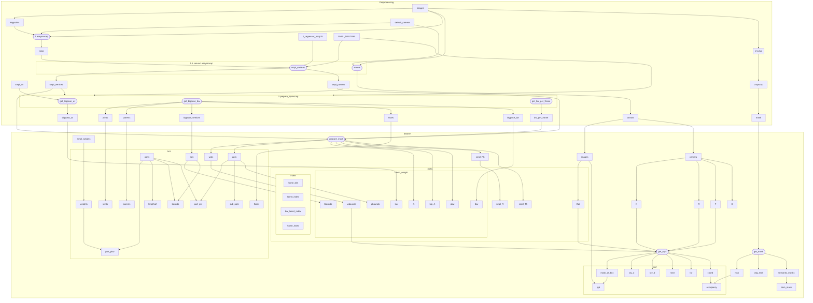

# Fast Reconstruction of Dynamic Human Body from Monocular Video
## Data stream


## 环境配置
### instant-nvr
```shell
conda create -n instant-nvr python=3.9
conda activate instant-nvr
conda install pytorch==1.13.0 torchvision==0.14.0 torchaudio==0.13.0 pytorch-cuda=11.7 -c pytorch -c nvidia
conda install -c fvcore -c iopath -c conda-forge fvcore iopath
conda install -c bottler nvidiacub

conda install pytorch3d=0.7.2 -c pytorch3d

pip install -r requirements.txt
```
默认 cuda 11.7
```bash
export PATH=/usr/local/cuda-11.7/bin:$PATH
export LD_LIBRARY_PATH=/usr/local/cuda-11.7/lib64:$LD_LIBRARY_PATH
```

### easymocap
书接上文 python 3.9, torch 1.13.0, cuda 11.7 的环境  
更新最新的 `setuptools`
```bash
pip install -U setuptools
```

```bash
git clone https://github.com/zju3dv/EasyMocap.git
pip install -r requirements.txt
pip install pyrender
python setup.py develop
```


### [schp](https://chingswy.github.io/easymocap-public-doc/install/install_segment.html#schp-self-correction-for-human-parsing)
```bash
git clone https://github.com/facebookresearch/detectron2.git
cd detectron2
rm -r build/ **/*.so
cd ..
pip install -e detectron2
```

```bash
cd EasyMocap/3rdparty
git clone https://github.com/chingswy/Self-Correction-Human-Parsing.git
```


### 杂项
```bash
sudo apt-get install libboost-dev
git clone https://github.com/MPI-IS/mesh.git
pip install --upgrade pip==22.3.1 # 回滚 pip 到 22.3.1
cd mesh
vim requirements.txt # 删除 requirements.txt 中 pyopengl, numpy
make all 
pip install numpy==1.23 # smpl 需要 chumpy, chumpy 需要 numpy <= 1.23
```

## 权重下载
需要下载一些权重
1. 在 [这里](https://drive.google.com/drive/folders/1hOTihvbyIxsm5ygDpbUuJ7O_tzv4oXjC) 下载 pose_hrnet_w48_384x288.pth
2. torch.hub.load 会联网下载 yolov5m
3. 同样需要准备 yolov4.weight, 在 [这里](https://github.com/AlexeyAB/darknet/releases/download/darknet_yolo_v3_optimal/yolov4.weights)
4.  [在这](https://github.com/mkocabas/PARE/releases/download/v0.1/pare-github-data.zip) 下载 pare 在 3dpw 数据集上的预训练模型, 需要的是:
```
pare-github-data\data\pare\checkpoints\pare_w_3dpw_checkpoint.ckpt
pare-github-data\data\pare\checkpoints\pare_w_3dpw_config.yaml
pare-github-data\data\smpl_mean_params.npz
```
`pare-github-data` 要改成 `models/pare` (写死的)

在 [这里](https://drive.google.com/drive/folders/1uOaQCpNtosIjEL2phQKEdiYd0Td18jNo) 下载参数 
```
detectron2_maskrcnn_cihp_finetune.pth
exp_schp_multi_cihp_global.pth
exp_schp_multi_cihp_local.pth
exp-schp-201908261155-lip.pth
```

smpl 需要向相关人员申请.

```
path/to/models
├── pare
│   └── data
│       ├── pare
│       │   └── checkpoints
│       │       ├── pare_w_3dpw_checkpoint.ckpt
│       │       └── pare_w_3dpw_checkpoint.yaml
│       └── smpl_mean_params.npz
├── schp
│   ├── detectron2_maskrcnn_cihp_finetune.pth
│   ├── exp_schp_multi_cihp_global.pth
│   ├── exp_schp_multi_cihp_local.pth
│   └── exp-schp-201908261155-lip.pth
├── pose_hrnet_w48_384x288.pth
├── yolov4.weights
└── yolov5m.pt

path/to/smpl
├── faces.npy
├── J_regressor_body25.npy
├── parents.npy
├── SMPL_NEUTRAL.pkl
├── smpl_uv.obj
└── weights.npy
```
## 数据格式
```
path/to/data
└── videos
    └── xxx.mp4
```

## 预处理 汇总
```
cd instant-nvr
python tools/monocular.py --cfg_file configs/monocular.yml
```

记得修改 `configs/monocular.yml` 中的参数.

## 预处理 分步
### 1 easymocap
```shell
python apps/preprocess/extract_keypoints.py ${data_root} --mode yolo-hrnet --gpu 1
emc --data config/datasets/svimage.yml --exp config/1v1p/hrnet_pare_finetune.yml --root ${data_root} --ranges 0 200 1 --subs 0
```
1. 提取 keypoints [doc](https://chingswy.github.io/easymocap-public-doc/quickstart/keypoints.html)
2. 单目估计 smpl [doc](https://chingswy.github.io/easymocap-public-doc/quickstart/quickstart.html)

#### 输入
- 视频

#### 输出
- keypoints
- images
- smpl


### 1.5 转换 easymocap 的结果
```bash
python tools/easymocap2instant-nvr.py --data_root ${data_root} --model_path ${smpl_model_path} --regressor_path ${smpl_regressor_path} --ranges 0 200 1
```

#### 输入
- vertices (每帧)
  - smpl
- SMPL_NEUTRAL.pkl 与 J_regressor_body25.npy 
- annots
  - 相机 DKRT (可选)
  - 图片路径

#### 输出
- smpl vertices (每帧)
- annots

### 2 schp
记得把 config 中的路径指向下载的 model
```shell
cd EasyMocap/3rdparty/Self-Correction-Human-Parsing
python extract_multi.py ${data_root} --ckpt_dir ${schp_models_path} --subs 0 --gpus 1 
mv ${data_root}/mask-schp-parsing ${data_root}/schp
python tools/cropschp.py --data_root ${data_root}
```
最好使用绝对目录, 因为程序中会改变运行的目录, 可能会导致花里胡哨的问题. 

裁剪是为了把多余的人裁去

#### 小修改
如果跑不起来, 在 `EasyMocap/3rdparty/Self-Correction-Human-Parsing/networks/AugmentCE2P.py` 中, 把
```python
BatchNorm2d = functools.partial(InPlaceABNSync, activation='none')
```
改为
```python
BatchNorm2d = nn.BatchNorm2d

class InPlaceABNSync(BatchNorm2d):
    def __init__(self, *args, **kwargs):
        super(InPlaceABNSync, self).__init__(*args, **kwargs)
        self.act = nn.LeakyReLU()

    def forward(self, input):
        output = super(InPlaceABNSync, self).forward(input)
        output = self.act(output)
        return output
```

#### 输入
- 图片
#### 输出
- mask


### 3 脚本
```bash
python tools/prepare_zjumocap.py --data_root ${data_root} --output_root ${data_root} --smpl_model_path ${smpl_model_path} --smpl_uv_path ${smpl_uv_path} --ranges 0 200 1
```

#### 输入
- person 
  - params 
  - vertices
- smpl
  - SMPL_NEUTRAL.pkl
  - smpl_uv.obj

#### 输出
- smpl_lbs 中的 joints 与 parents
- bigpose_vertices 与 face
- bigpose_bw 与 bigpose_uv
- 第 i 帧的 姿势的 p blend weight

## TODO-lsit
- [x] 把所有的程序写成接受参数的样子
- [x] 汇总参数为一个 cfg, 并在总脚本时调用