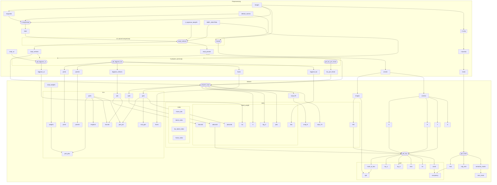

# Fast Reconstruction of Dynamic Human Body from Monocular Video
## Data stream


## Environment Configuration
### [instant-nvr](https://zju3dv.github.io/instant_nvr/)
```shell
conda create -n instant-nvr python=3.9
conda activate instant-nvr
conda install pytorch==1.13.0 torchvision==0.14.0 torchaudio==0.13.0 pytorch-cuda=11.7 -c pytorch -c nvidia
conda install -c fvcore -c iopath -c conda-forge fvcore iopath
conda install -c bottler nvidiacub
conda install pytorch3d=0.7.2 -c pytorch3d

cd instant-nvr
pip install -r requirements.txt
```

### [easymocap](https://chingswy.github.io/easymocap-public-doc/install/install.html#20230630-update)
Continuing from the previous text, the environment is python 3.9, torch 1.13.0, cuda 11.7.  
Update to the latest `setuptools`.
```bash
pip install -U setuptools
```

```bash
git clone https://github.com/zju3dv/EasyMocap.git
pip install -r requirements.txt
pip install pyrender
python setup.py develop
```


### [schp](https://chingswy.github.io/easymocap-public-doc/install/install_segment.html#schp-self-correction-for-human-parsing)
```bash
git clone https://github.com/facebookresearch/detectron2.git
cd detectron2
rm -r build/ **/*.so
cd ..
pip install -e detectron2
```

```bash
cd EasyMocap/3rdparty
git clone https://github.com/chingswy/Self-Correction-Human-Parsing.git
```


### Miscellaneous
```bash
sudo apt-get install libboost-dev
git clone https://github.com/MPI-IS/mesh.git
pip install --upgrade pip==22.3.1 # Rollback pip to 22.3.1
cd mesh
vim requirements.txt # Delete pyopengl, numpy from requirements.txt
make all 
pip install numpy==1.23 # smpl needs chumpy, chumpy needs numpy <= 1.23
```

## Models Download
Some models need to be downloaded:
1. Download `pose_hrnet_w48_384x288.pth` from [here](https://drive.google.com/drive/folders/1hOTihvbyIxsm5ygDpbUuJ7O_tzv4oXjC).
2. `torch.hub.load` will download `yolov5m` online.
3. Also need to prepare `yolov4.weight`, available [here](https://github.com/AlexeyAB/darknet/releases/download/darknet_yolo_v3_optimal/yolov4.weights).
4. Download the pre-trained model of pare on the 3dpw dataset from [here](https://github.com/mkocabas/PARE/releases/download/v0.1/pare-github-data.zip), what you need are:
```
pare-github-data\data\pare\checkpoints\pare_w_3dpw_checkpoint.ckpt
pare-github-data\data\pare\checkpoints\pare_w_3dpw_config.yaml
pare-github-data\data\smpl_mean_params.npz
```
5. Download parameters from [here](https://drive.google.com/drive/folders/1uOaQCpNtosIjEL2phQKEdiYd0Td18jNo).
```
detectron2_maskrcnn_cihp_finetune.pth
exp_schp_multi_cihp_global.pth
exp_schp_multi_cihp_local.pth
exp-schp-201908261155-lip.pth
```
6. [smpl](https://smpl.is.tue.mpg.de/) needs to be applied from relevant personnel.

File structure example:
```
path/to/models
├── pare
│   └── data
│       ├── pare
│       │   └── checkpoints
│       │       ├── pare_w_3dpw_checkpoint.ckpt
│       │       └── pare_w_3dpw_checkpoint.yaml
│       └── smpl_mean_params.npz
├── schp
│   ├── detectron2_maskrcnn_cihp_finetune.pth
│   ├── exp_schp_multi_cihp_global.pth
│   ├── exp_schp_multi_cihp_local.pth
│   └── exp-schp-201908261155-lip.pth
├── pose_hrnet_w48_384x288.pth
├── yolov4.weights
└── yolov5m.pt

path/to/smpl-meta
├── faces.npy
├── J_regressor_body25.npy
├── parents.npy
├── SMPL_NEUTRAL.pkl
├── smpl_uv.obj
└── weights.npy

path/to/data
└── videos
    └── video.mp4
```

## Quick Start
```
cd instant-nvr
python tools/monocular.py --cfg_file configs/monocular.yml
```
Remember to modify the parameters in `configs/monocular.yml`.

## Preprocessing Step-by-step
### 0. Prepare Video
Take this [video](https://youtu.be/23EfsN7vEOA?si=vqeDG7wMtXUo9H-0) as an example.
```
data/internet-rotate
└── videos
    └── 23EfsN7vEOA+003170+003670.mp4
```

```shell
data_root=data/internet-rotate
schp_models_path=data/models/schp
smpl_model_path=data/smpl-meta/SMPL_NEUTRAL.pkl
smpl_regressor_path=data/smpl-meta/J_regressor_body25.npy
smpl_uv_path=data/smpl-meta/smpl_uv.obj
```

### 1. easymocap
```shell
cd EasyMocap
python apps/preprocess/extract_keypoints.py ${data_root} --mode yolo-hrnet --gpu 1
emc --data config/datasets/svimage.yml --exp config/1v1p/hrnet_pare_finetune.yml --root ${data_root} --ranges 0 200 1 --subs 23EfsN7vEOA+003170+003670
```
The first step is to extract keypoints, details refer to [doc](https://chingswy.github.io/easymocap-public-doc/quickstart/keypoints.html#yolov4hrnet).  
The second step is monocular estimation of smpl, details refer to [doc](https://chingswy.github.io/easymocap-public-doc/quickstart/quickstart.html#demo-on-monocular-videos), remember to modify `regressor_path` and `model_path` in `hrnet_pare_finetune.yml` to point to `smpl_regressor_path` and `smpl_model_path` respectively. Remove unnecessary `render` and `make_video` parts.


### 2. schp
```shell
cd EasyMocap/3rdparty/Self-Correction-Human-Parsing
python extract_multi.py ${data_root} --ckpt_dir ${schp_models_path} --subs 0 --gpus 1 
mv ${data_root}/mask-schp-parsing ${data_root}/schp
python tools/cropschp.py --data_root ${data_root}
```
Details refer to [doc](https://chingswy.github.io/easymocap-public-doc/install/install_segment.html#schp-self-correction-for-human-parsing). It is best to use absolute directories, because the program will change the running directory, which may cause fancy problems.   
`cropschp.py` is to cut off the extra people.


### 3. Convert data format
#### 3.1. Convert easymocap 
```bash
cd instant-nvr
python tools/easymocap2instant-nvr.py --data_root ${data_root} --model_path ${smpl_model_path} --regressor_path ${smpl_regressor_path} --ranges 0 200 1
```

#### 3.2. Convert smpl
```bash
cd instant-nvr
python tools/prepare_zjumocap.py --data_root ${data_root} --output_root ${data_root} --smpl_model_path ${smpl_model_path} --smpl_uv_path ${smpl_uv_path} --ranges 0 200 1
```

## Train
```shell
python train_net.py --cfg_file ${cfg_path}
```
Make cfg according to `default.yml`, modify `data_root`, `ann_file` in `[train, val, test]_dataset` to point to the correct path. 

## Visualization
```shell
python run.py --type vis --cfg_file ${cfg_path}
```